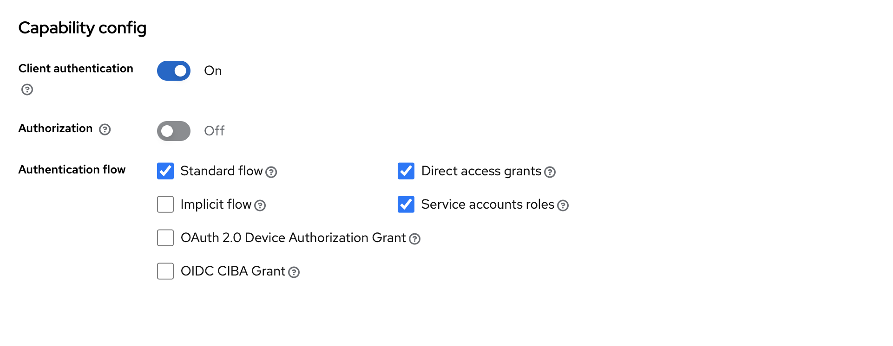
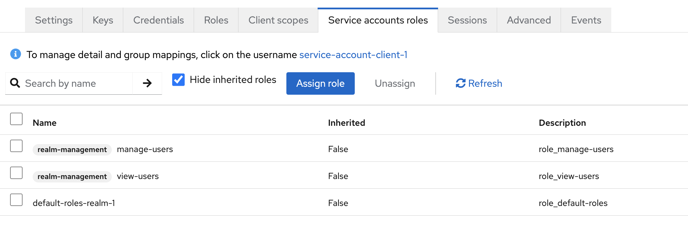

# python-keycloak-auth

A custom `users` database for maintaining users and their associated features (basic information, roles, permissions, links) for an application.
Authentication flow for users is managed by a 3rd party auth provider `keycloak`.

## Keycloak

### Setup

```
cd keycloak
docker compose up -d
```

Starts a Postgres DB and a Keycloak service which can be accessed at http://localhost:8080

See [Keycloak Setup](./keycloak/README.md) for more details.

### Configuration
- Create a realm in keycloak. Realm is a space to manage a set of users, roles, and clients.
- Create a client in keycloak. Client is the application that uses keycloak to authenticate, authorize, and manage users.
- Enable the following for the client:
    - `Client Authentication`
    - `Direct Access Grants`
    - `Standard Flow`
    - `Service Account Roles`
    

    
- In the service account roles, assign `manage-users` and `view-users` roles to the client.


| Purpose                       | Flow to Use                                                                                              | Why                                                                                                                                             |
| ----------------------------- | -------------------------------------------------------------------------------------------------------- | ----------------------------------------------------------------------------------------------------------------------------------------------- |
| **Creating/managing users**   | Service Accounts (Client Credentials Grant)                                                              | The client (backend app) authenticates itself with client ID & secret, gets an admin token, and calls Keycloak Admin API to create/manage users. |
| **User login/authentication** | Direct Access Grants (Resource Owner Password Credentials) or better: Standard Flow (Authorization Code) | Users provide their username/password, your app gets user tokens to allow access to the application.                                    |

## Authentication flow

1. Backend uses client credentials to create users in Keycloak realm.  
2. User logs in with username and password.  
3. Keycloak returns access token (short-lived) and refresh token (long-lived).  
4. Frontend sends access token with API requests to authenticate user.  
5. When access token expires, frontend uses refresh token to request a new access token.  
6. If refresh token is invalid or expired, user must log in again.  
7. User logs out by frontend calling logout API with refresh token to revoke session.  
8. Keycloak session deletion invalidates refresh token and access token immediately.  
9. Frontend can detect user inactivity and trigger logout to clear tokens and session.  

## Auth & Token Endpoints

- `GET /auth/token/client-credentials` — Get access token using client credentials (no user auth needed). Just for testing.
- `POST /auth/login` — Log in with username/password, get tokens.
- `POST /auth/token/refresh` — Refresh access token using refresh token.
- `POST /auth/logout` — Log out by invalidating refresh token.
- `POST /auth/token/validate` — Validate access or refresh token.